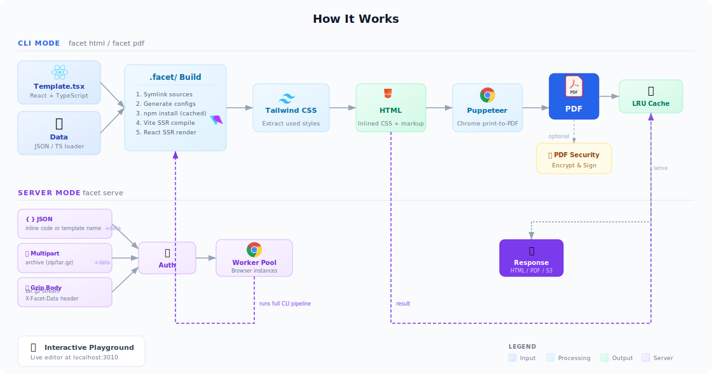
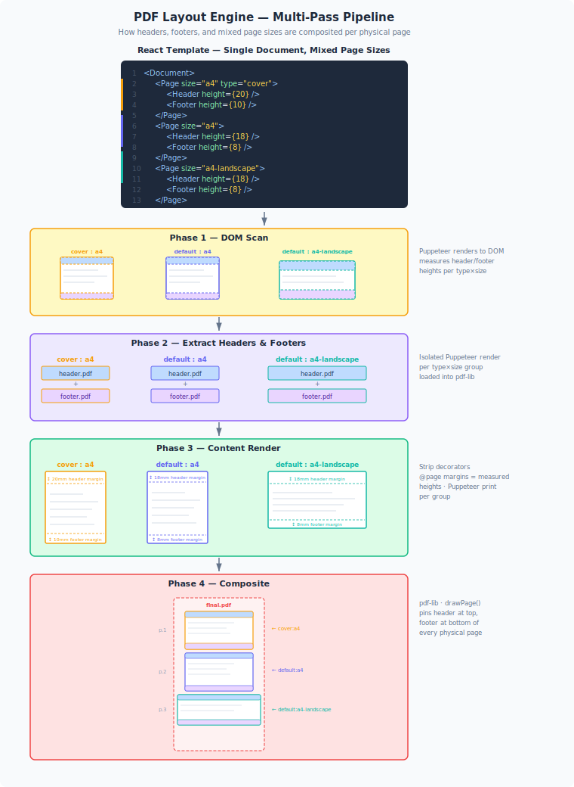

# @flanksource/facet

Build beautiful, print-ready datasheets and PDFs from React templates.

**@flanksource/facet** is a framework for creating professional datasheets, reports, and documentation using React components. It provides a rich component library optimized for print and PDF generation, along with a powerful CLI for building HTML and PDF outputs.

## Features

- 📄 **Print-optimized components** - 47+ components designed for professional datasheets
- 🎨 **React & TypeScript** - Full type safety and modern React patterns
- 🔧 **Zero-config CLI** - Build HTML and PDF with a single command
- 🔗 **Component imports** - `import { StatCard } from '@flanksource/facet'`
- ⚡ **Fast builds** - Powered by Vite with smart caching
- 📦 **Isolated builds** - `.facet/` build directory (like `.next` in Next.js)

## Installation

### Option 1: npm Package (Recommended)

```bash
npm install -g @flanksource/facet
```

### Option 2: Standalone Binary

Download platform-specific binaries from [GitHub Releases](https://github.com/flanksource/facet/releases):

- **Linux**: `facet-linux`
- **macOS**: `facet-macos`
- **Windows**: `facet-windows.exe`

Make executable (Linux/macOS):
```bash
chmod +x facet-*
sudo mv facet-* /usr/local/bin/facet
```

## Quick Start

### 1. Create a Template

Create a file `MyDatasheet.tsx` in your project:

```tsx
import React from 'react';
import {
  DatasheetTemplate,
  Header,
  Page,
  StatCard,
  Section,
  BulletList
} from '@flanksource/facet';

export default function MyDatasheet() {
  return (
    <DatasheetTemplate>
      <Header
        title="Mission Control Platform"
        subtitle="Cloud-Native Observability & Incident Management"
      />

      <Page>
        <Section title="Key Metrics">
          <div className="grid grid-cols-3 gap-4">
            <StatCard label="Response Time" value="< 2min" />
            <StatCard label="Uptime" value="99.99%" />
            <StatCard label="Incidents Resolved" value="1,247" />
          </div>
        </Section>

        <Section title="Key Features">
          <BulletList items={[
            'Real-time incident detection and alerting',
            'Automated runbook execution',
            'Multi-cloud observability',
            'Integrated ChatOps workflows'
          ]} />
        </Section>
      </Page>
    </DatasheetTemplate>
  );
}
```

### 2. Build HTML Output

```bash
facet html MyDatasheet.tsx -o ./dist
```

This creates:
- Print-ready HTML with embedded styles
- Scoped HTML for embedding in docs (use `--css-scope` for a custom prefix)
- `.facet/` - Build cache directory (can be gitignored)

### 3. Generate PDF

```bash
facet pdf MyDatasheet.tsx
```

## How It Works




### Build Process

**CLI mode** — `facet html` and `facet pdf` run the full pipeline locally:

1. **Setup `.facet/`** — Creates an isolated build directory with symlinks to your sources
2. **Generate configs** — Auto-generates `vite.config.ts`, `tsconfig.json`, `entry.tsx`
3. **Vite SSR compile** — Compiles React + TypeScript + MDX via Vite
4. **React SSR render** — Renders components to static HTML with `ReactDOMServer`
5. **Tailwind CSS** — Extracts only the styles your template uses
6. **HTML output** — Combines markup + inlined CSS into a self-contained HTML file
7. **PDF output** *(optional)* — Puppeteer prints the HTML to PDF, with optional encryption and digital signatures

**Server mode** — `facet serve` wraps the same pipeline behind an HTTP API with a worker pool, LRU cache, optional S3 upload, and an interactive playground at `localhost:3010`.


## Page Component API

The `Page` component is the primary layout container for multi-page PDF documents.

```tsx
<Page
  title="Section Title"
  product="Mission Control"
  header={<Header variant="solid" />}
  headerHeight={15}
  footer={<PdfFooter />}
  footerHeight={15}
  margins={{ top: 5, right: 0, bottom: 0, left: 0 }}
  watermark="DRAFT"
  debug={false}
>
  {/* page content */}
</Page>
```

| Prop | Type | Default | Description |
|------|------|---------|-------------|
| `children` | `ReactNode` | — | Page content |
| `title` | `string` | — | Section title bar text (renders a blue bar below the header) |
| `product` | `string` | — | Sub-label shown in the title bar |
| `header` | `ReactNode` | — | Fixed header rendered at the top of every physical page |
| `headerHeight` | `number` (mm) | `0` | Height of the header; used to offset content so it doesn't overlap |
| `footer` | `ReactNode` | — | Fixed footer rendered at the bottom of every physical page |
| `footerHeight` | `number` (mm) | `15` | Height of the footer; used to add bottom padding to content |
| `margins` | `PageMargins` | `{}` | Additional content margins `{ top, right, bottom, left }` in mm |
| `pageSize` | `string` | `'a4'` | Page size — `a4`, `a3`, `letter`, `legal`, `fhd`, `a4-landscape`, or custom `WxH` in mm |
| `type` | `string` | `'default'` | Page type — groups pages for header/footer extraction (e.g. `cover`, `default`) |
| `watermark` | `string` | — | Diagonal watermark text (e.g. `"DRAFT"`, `"CONFIDENTIAL"`) |
| `debug` | `boolean` | `false` | Renders dashed red lines at margin boundaries for layout debugging |
| `className` | `string` | — | Extra CSS class applied to the `<main>` element |

### Multi-page PDF layout

A single React document with mixed page sizes (e.g. `<Page size="a4" type="cover">`, `<Page size="a4">`, `<Page size="a4-landscape">`) is compiled into a final PDF via a 4-phase multi-pass pipeline:

1. **DOM Scan** — Puppeteer renders to DOM, measures header/footer heights per type×size group (e.g. `cover:a4`, `default:a4`, `default:a4-landscape`)
2. **Extract** — Each unique type×size group's header and footer are rendered as isolated PDFs using a dedicated Puppeteer pass, loaded into pdf-lib
3. **Content Render** — Decorators are stripped from the DOM; `@page` margins are set to the measured header/footer heights; Puppeteer prints content-only PDFs per group
4. **Composite** — pdf-lib `page.drawPage()` overlays the correct header at the top and footer at the bottom of every physical page, producing a single merged PDF

```tsx
  {/* Cover page with unique header/footer */}
  <Page pageSize="a4" type="cover">
    <Header height={20} />
    <CoverContent />
    <Footer height={10} />
  </Page>

  {/* Standard A4 page */}
  <Page pageSize="a4">
    <Header height={18} />
    {/* Content starts after header automatically */}
    <Footer height={8} />
  </Page>

  {/* Landscape page for wide content */}
  <Page pageSize="a4-landscape">
    <Header height={18} />
    <WideTableContent />
    <Footer height={8} />
  </Page>
```



## CLI Commands

### `facet html <template>`

Generate HTML from a React template.

```
facet html [options] <template>

Options:
  --css-scope <prefix>         CSS scope prefix for scoped HTML generation
  -s, --schema <file>          Path to JSON Schema file for data validation
  --no-validate                Skip data validation
  -d, --data <file>            Path to JSON data file
  -l, --data-loader <file>     Path to data loader module (.ts or .js)
  -o, --output <path>          Output file path or directory (default: "dist")
  --output-name-field <field>  Data field to use for output filename
  -v, --verbose                Enable verbose logging
```

**Example:**
```bash
facet html MyDatasheet.tsx -o ./dist --verbose
facet html MyDatasheet.tsx -d data.json -o report.html
```

### `facet pdf <template>`

Generate PDF from a React template.

```
facet pdf [options] <template>

Options:
  -s, --schema <file>          Path to JSON Schema file for data validation
  --no-validate                Skip data validation
  -d, --data <file>            Path to JSON data file
  -l, --data-loader <file>     Path to data loader module (.ts or .js)
  -o, --output <path>          Output file path or directory (default: "dist")
  --output-name-field <field>  Data field to use for output filename
  -v, --verbose                Enable verbose logging
```

**Example:**
```bash
facet pdf MyDatasheet.tsx -d data.json -o out.pdf
```

### `facet serve`

Start an API server with a built-in playground for interactive template development.

```
facet serve [options]

Options:
  -p, --port <number>          Server port (default: 3010)
  --templates-dir <dir>        Directory containing templates (default: ".")
  --workers <count>            Number of browser workers (default: 2)
  --timeout <ms>               Render timeout in milliseconds (default: 60000)
  --api-key <key>              API key for authentication
  --max-upload <bytes>         Max upload size in bytes (default: 52428800)
  --cache-max-size <bytes>     Max render cache size in bytes (default: 104857600)
  --s3-endpoint <url>          S3 endpoint URL
  --s3-bucket <name>           S3 bucket name
  --s3-region <region>         S3 region (default: us-east-1)
  --s3-prefix <prefix>         S3 key prefix
  -v, --verbose                Enable verbose logging
```

**Example:**
```bash
facet serve --templates-dir ./templates --port 3010

# With authentication
facet serve --api-key my-secret-key

# With S3 upload
facet serve --s3-endpoint https://s3.amazonaws.com --s3-bucket my-bucket
```

The playground is available at `http://localhost:3010/` with a Monaco editor, live preview, and render logs.

See [openapi.yaml](openapi.yaml) for the full API specification.

### Docker

```bash
docker run -p 3000:3000 -v ./templates:/templates ghcr.io/flanksource/facet
```

### Helm

```bash
helm install facet ./chart
```

See [chart/values.yaml](chart/values.yaml) for configuration options.

### Why `.facet/`?

Similar to Next.js (`.next/`) or Nuxt (`.nuxt/`), the `.facet/` directory:
- **Isolates build artifacts** - Keeps your project clean
- **Enables fast rebuilds** - Symlinks avoid file copying
- **Supports incremental builds** - Only rebuilds what changed
- **Simplifies debugging** - All build files in one place

**Add to `.gitignore`:**

```gitignore
.facet/
dist/
```

## Import Patterns

### Named Imports (Recommended)
```tsx
import { StatCard, Header, Page } from '@flanksource/facet';
```

### TypeScript Support

All components include full TypeScript definitions:

```tsx
import { StatCard } from '@flanksource/facet';

<StatCard
  label="Response Time"  // string
  value="< 2min"         // string | number
  trend="up"             // 'up' | 'down' | 'neutral' (optional)
  icon="clock"           // string (optional)
/>
```

## Styling

Components use Tailwind CSS for styling. Include Tailwind in your project:

```bash
npm install -D tailwindcss autoprefixer postcss
```

**tailwind.config.js:**
```js
module.exports = {
  content: [
    './MyDatasheet.tsx',
    './node_modules/@facet/core/src/components/**/*.tsx'
  ],
  theme: {
    extend: {},
  },
  plugins: [],
}
```

## MDX Support

Templates support MDX for content-rich pages:

```tsx
// MyDatasheet.tsx
import Content from './content.mdx';

export default function MyDatasheet() {
  return (
    <DatasheetTemplate>
      <Content />
    </DatasheetTemplate>
  );
}
```

```mdx
# content.mdx

## Overview

This is **MDX content** with React components:

<StatCard label="Users" value="10,000+" />

- Bullet point one
- Bullet point two
```

## Development

### Component Development

Use Storybook for component development:

```bash
npm run storybook
```

### Building the CLI

```bash
npm run build:cli
```

### Publishing

```bash
npm run prepublishOnly  # Builds CLI automatically
npm publish
```

## Architecture

- **`src/components/`** - React component library (47 components)
- **`src/styles.css`** - Global styles and Tailwind
- **`cli/`** - CLI package source
  - **`cli/src/builders/`** - Build orchestration
  - **`cli/src/generators/`** - HTML/PDF generators
  - **`cli/src/utils/`** - Shared utilities
  - **`cli/src/plugins/`** - Vite plugins
- **`assets/`** - Static assets (logos, icons)

## Examples

See `src/examples/` for complete working examples:

- **Basic Datasheet** - Simple single-page datasheet
- **Multi-page Report** - Complex multi-page document
- **Security Report** - Security-focused datasheet
- **POC Evaluation** - POC evaluation template

## Contributing

This is an internal Flanksource package. For issues or feature requests, contact the platform team.

## License

Proprietary - Flanksource Inc.

---

**Built with ❤️ by Flanksource**
