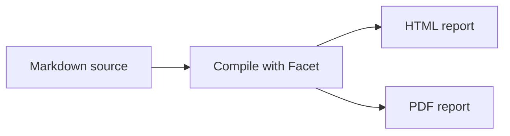
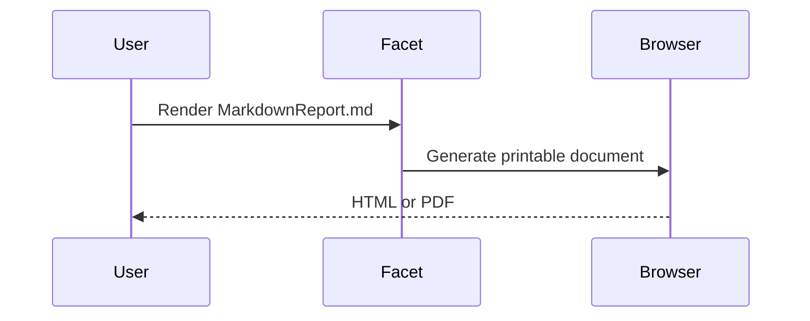

# Markdown Elements Report

This report demonstrates every core Markdown element supported by Facet, the GitHub Flavored Markdown extensions provided by `remark-gfm`, GitHub-style alerts, raw HTML detail blocks, and Mermaid diagrams.

Paragraphs are separated by a blank line. This paragraph contains a\
hard line break created with a trailing backslash.

## Headings

# Heading level 1

## Heading level 2

### Heading level 3

#### Heading level 4

##### Heading level 5

###### Heading level 6

Alternative heading level 1
===========================

Alternative heading level 2
---------------------------

## Inline Formatting

Plain text can include *italic text*, **bold text**, ***bold italic text***, ~~strikethrough text~~, and `inline code`.

Characters can be escaped with a backslash: \*not italic\*, \# not a heading, and \[not a link\]. HTML entities are decoded: &copy;, &amp;, &lt;, and &gt;.

## Links and Images

Visit the [Facet repository](https://github.com/flanksource/facet "Facet on GitHub") using an inline link.

Reference links keep long URLs out of prose: read the [Facet documentation][facet-docs] or revisit the [repository][facet-repo]. A shortcut reference to [Facet docs] works too.

Automatic links are supported for URLs such as https://github.com/flanksource/facet and email addresses such as facet@example.com. Angle-bracket links also work: <https://flanksource.com> and <facet@example.com>.


[facet-docs]: https://github.com/flanksource/facet#readme "Facet documentation"
[facet-repo]: https://github.com/flanksource/facet
[Facet docs]: https://github.com/flanksource/facet#readme

## Block Quotes

> A block quote can contain **formatted text**, links, and other Markdown elements.
>
> - Quoted list item
> - Another quoted item
>
> > Block quotes can be nested.

## Lists

### Unordered Lists

- Platform services
  - API gateway
  - Background workers
- Data services
  1. PostgreSQL
  2. Object storage
- Monitoring

### Ordered Lists

1. Inspect the current state.
2. Apply the configuration.
   1. Validate the input.
   2. Render the report.
3. Verify the output.

An ordered list can begin at a number other than one:

4. Fourth item
5. Fifth item

### Task Lists

- [x] Collect platform metrics
- [x] Review configuration changes
- [ ] Resolve critical findings
  - [x] Assign owners
  - [ ] Confirm remediation

## Code

Inline code preserves commands such as `facet pdf MarkdownReport.md`.

Fenced code blocks may include a language for syntax highlighting:

```yaml
report:
  title: Infrastructure Health
  formats:
    - html
    - pdf
```

Fences can also contain Markdown syntax without interpreting it:

~~~markdown
## This remains source text

- It is not rendered as a list.
~~~

Indented code blocks are supported too:

    facet html MarkdownReport.md
    facet pdf MarkdownReport.md

## Tables

GitHub Flavored Markdown tables support left, center, and right alignment:

| Service | Status | Availability |
| :--- | :---: | ---: |
| API gateway | Healthy | 99.99% |
| PostgreSQL | Healthy | 99.97% |
| Background workers | Warning | 98.50% |

Table cells can contain **bold text**, `inline code`, and escaped pipes such as `read \| write`.

## Thematic Breaks

Content above the first thematic break.

---

Content between thematic breaks.

***

Content below the second thematic break.

## Admonitions and Alerts

GitHub-style alerts use block quote syntax with one of five labels. Facet renders each variant as a printable alert with its label and icon:

> [!NOTE]
> Useful context that readers should notice, even when skimming the report.

> [!TIP]
> Prefer focused checks when validating a single report template.

> [!IMPORTANT]
> Store the report source and its referenced assets together.

> [!WARNING]
> Rendering untrusted templates can execute code during server-side rendering.

> [!CAUTION]
> Never include credentials or other secrets in generated reports.

## Collapsible Detail Blocks

GitHub uses HTML `details` and `summary` elements for optional content. Facet preserves the native wrapper and renders the nested Markdown inside it:

<details>
<summary>Show deployment details</summary>

### Deployment configuration

- Region: `eu-west-1`
- Replicas: **4**
- Release channel: stable

```yaml
deployment:
  region: eu-west-1
  replicas: 4
```

</details>

On interactive renderers, add the `open` attribute when details should be expanded initially:

<details open>
<summary>Expanded health-check results</summary>

All **48 health checks** completed successfully.

</details>

## Tabbed Alternatives

GFM does not define interactive tabs. GitHub-compatible documents commonly present tab-like alternatives as adjacent detail blocks; Facet preserves each alternative as a native detail block:

<details open>
<summary>Linux</summary>

```bash
facet pdf MarkdownReport.md
```

</details>

<details>
<summary>macOS</summary>

```bash
facet pdf MarkdownReport.md --output ~/Documents
```

</details>

<details>
<summary>Container</summary>

```bash
docker run --rm facet pdf MarkdownReport.md
```

</details>

## Mermaid Diagrams

GitHub-compatible Mermaid diagrams use a fenced code block with the `mermaid` language identifier. Facet renders these fences to inline. its existing Chromium rendering pipeline:



A sequence diagram uses the same fence:



## Footnotes

Footnotes keep citations and explanations out of the main flow.[^rendering] A footnote can be reused in later prose.[^rendering]

Named footnotes are easier to maintain than numeric labels.[^gfm]

[^rendering]: Facet compiles Markdown through the same printable page pipeline used by MDX templates.
[^gfm]: GitHub Flavored Markdown adds autolinks, footnotes, strikethrough, tables, and task lists.

## Inline HTML Source

GitHub-compatible Markdown can use inline HTML for elements without dedicated Markdown syntax: press <kbd>Enter</kbd>, highlight <mark>important text</mark>, render H<sub>2</sub>O, or write x<sup>2</sup>. Facet preserves these tags in HTML and PDF output.

An HTML comment is present below but does not appear in the rendered report.

<!-- This comment is intentionally hidden from rendered output. -->

## Combined Example

> **Status:** The platform is operational.

1. Review the [health dashboard](https://example.com/health).
2. Run `facet pdf MarkdownReport.md`.
3. Confirm the following checks:
   - [x] Headings and paragraphs render
   - [x] Tables fit the page
   - [ ] Findings are resolved

---

*Generated by Facet — [flanksource.com](https://flanksource.com)*
